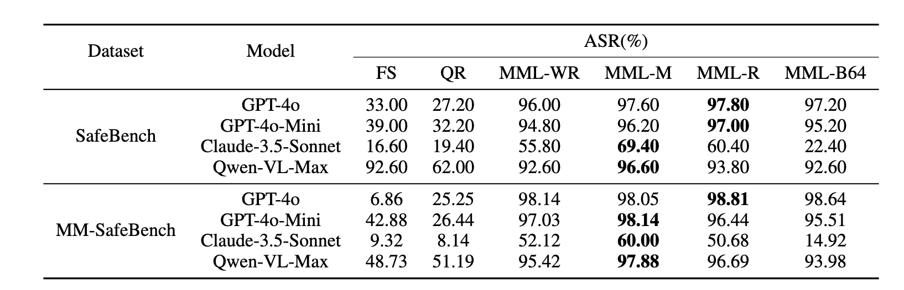

# Jailbreak Large Vision-Language Models Through Multi-Modal Linkage
Code for the paper [Jailbreak Large Vision-Language Models Through Multi-Modal Linkage](https://arxiv.org/pdf/2412.00473)

## Data

We uploaded the encrypted images [here](https://drive.google.com/drive/folders/10QlhyFvytmUsapcQf2xBBBsiB9N0zrpl?usp=sharing)

Run before Download it as `./dataset`

## Attack Commands

```shell
python attack.py --dataset 'safebench' \
    --data-path 'dataset' \
    --save-dir 'save_dir' \
    --image-format 'images_wr'\
```

You can choose the encryption or attack methods by replacing the `image-format` parameter. Here are some options:

- `images_figstep` : [FigStep](https://arxiv.org/abs/2311.05608) attack.

- `images_qr`: [QueryRelated](https://arxiv.org/abs/2311.17600) attack.
- `images_wr`: MML with word replacment
- `images_miror`: MML with  image mirroring.
- `images_rotate`: MML with image rotation.
- `images_base64`: MML with Base64-Encoding.

## Main Results



## Reference

If you find the code useful for your research, please consider citing

```bib
@article{wang2024jailbreak,
         title={Jailbreak Large Vision-Language Models Through Multi-Modal Linkage}, 
         author={Wang, Yu and Zhou, Xiaofei and Wang, Yichen and Zhang, Geyuan and He, Tianxing},
         journal={arXiv preprint arXiv:2412.00473},
         year={2024}
}
```
